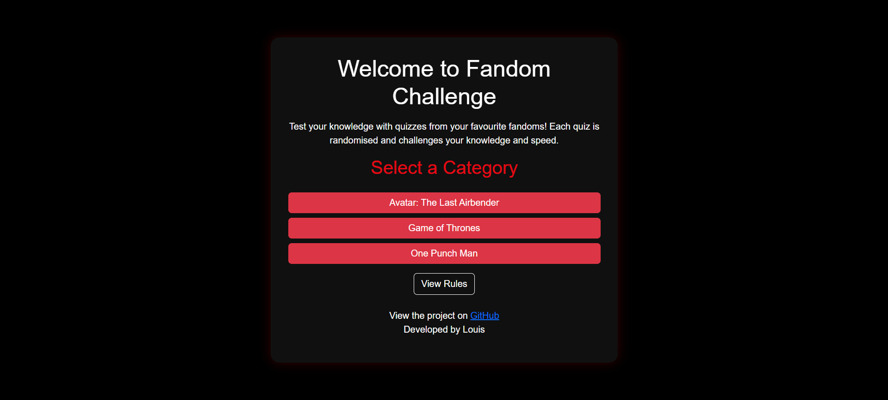
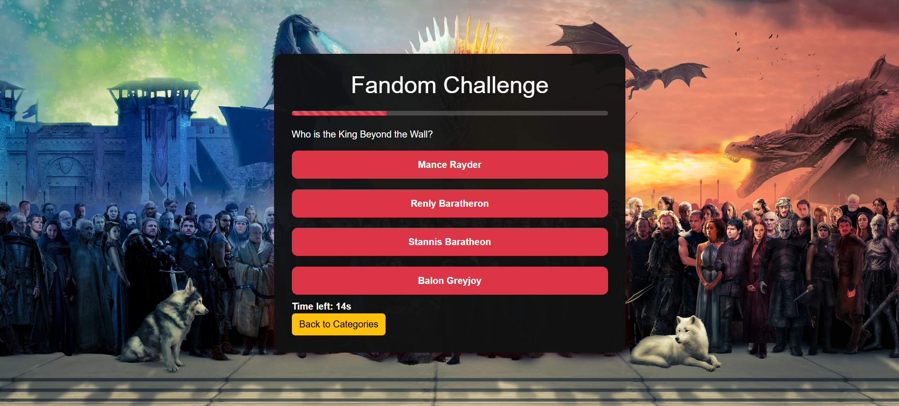
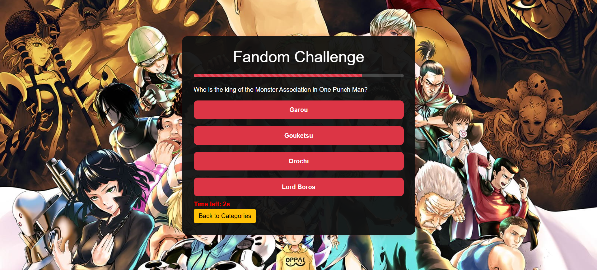
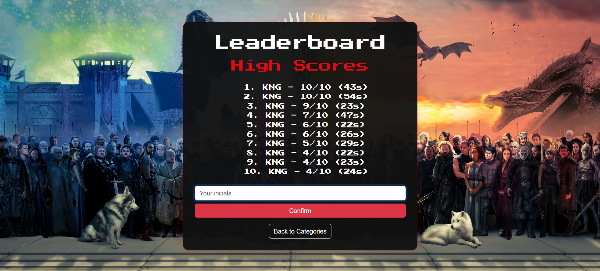
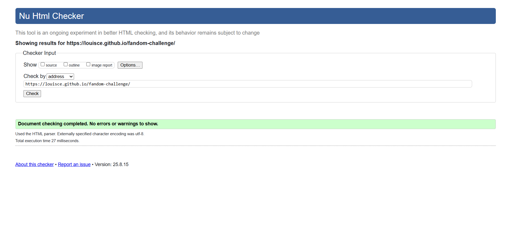

# Fandom Challenge

## Project Overview

Fandom Challenge is an interactive quiz game designed to test players’ knowledge across various fandoms, including anime, movies, TV shows, and games (for now, just Avatar: The Last Airbender and Game of Thrones). The project is built with HTML, CSS, and JavaScript, focusing on creating a fun, responsive, and accessible user experience. Players can select a category, answer randomised questions under time pressure, and receive instant feedback on their performance. The project demonstrates key front-end development skills, including DOM manipulation, event handling, responsive design, and dynamic content rendering. This project also demonstrates the use of localStorage for persistent leaderboard data, ensuring scores remain available even after the page is refreshed or the browser is closed. The quiz logic is fully randomised including question order and answer option positions to guarantee variety and replayability.

## User Goals

- Enjoy a fun and engaging quiz experience.
- Test knowledge across different fandoms.
- Choose from multiple quiz categories.
- Understand the quiz rules before playing.
- Play on any device with a responsive layout.
- Receive instant feedback on answers.
- Answer options are randomised each time to ensure true knowledge is tested.
- Compete against themselves and others by tracking and comparing high scores through a persistent leaderboard.
- Replay quizzes for better results and enhanced replayability.

## User Stories

1. As a new user, I want to easily navigate the website so I can find the quiz quickly.
2. As a player, I want to select from different categories so I can focus on my favourite fandoms.
3. As a player, I want to view the rules before starting so I know how the game works.
4. As a player, I want the quiz to display one question at a time so I can focus on answering it.
5. As a player, I want the answer options to be clickable so I can easily submit my choice.
6. As a player, I want instant feedback after each question so I know if I was correct.
7. As a player, I want a timer so I feel challenged and can’t spend too long on one question.
8. As a player, I want to see my final score at the end so I can track my performance.
9. As a returning player, I want the option to replay the quiz so I can improve my score.
10. As a player, I want the answer options to appear in a random order each quiz so I can't memorise positions.
11. As a competitive player, I want to see my best scores compared with others on the leaderboard so I stay motivated.
12. As a returning player, I want my saved scores to persist between sessions so I can track long-term progress.

## Website Goals and Objectives

- Create an engaging and user-friendly quiz application that appeals to fans of popular franchises.
- Provide a clear and intuitive interface for selecting quiz categories and understanding game rules.
- Ensure the application is fully responsive and accessible on a range of devices and screen sizes.
- Implement interactive features that give immediate feedback to users, enhancing the quiz experience.
- Randomise answer order on each question to improve quiz challenge and fairness.
- Include a leaderboard system so players can compare scores and compete.
- Maintain clean, well-structured code to support future updates and scalability.
- Adhere to web content accessibility standards (WCAG) to make the quiz usable by all users.
- Deploy the application on a reliable cloud platform with version control for easy collaboration and maintenance.
- Rigorously test responsiveness, accessibility, and functionality across multiple browsers and devices to ensure consistent quality.

## Wireframes

Wireframes were created using Balsamiq, following a mobile-first approach in line with best practices. I started by sketching layouts for mobile screens and then expanded them for tablet and desktop to make sure the structure worked at all breakpoints.

- The quiz layout was refined to make answer buttons larger and more tappable on mobile.
- The progress bar and timer were repositioned for better visibility.
- The rules page layout was simplified for faster reading.
- Background images were updated for visual impact and theme immersion.
- Minor spacing adjustments were made for a more balanced layout on larger screens.

The final live site follows the overall structure of the wireframes. Minor adjustments were made during development to fine-tune the visual flow and improve usability.

**Wireframe links:**

  
  

## Design Choices

### Typography

For this project, I selected the **Poppins** font for all text content. Poppins is a modern, sans-serif typeface that provides excellent readability across devices and screen sizes. Its geometric shapes give a clean and approachable look, which fits the energetic and playful theme of a fandom quiz.

Headings are bold and colored **Netflix red (#e50914)** to fit the fandom theme, create visual hierarchy and draw attention to key sections, while body text remains white against a dark background to ensure high contrast and legibility.  

Button text uses a slightly larger, bold style to improve clickability and usability. Typography choices were guided by accessibility, readability, and aesthetic alignment with the quiz’s theme.

### Colour Scheme

  

The **Fandom Challenge** quiz uses a passionate, bold colour palette based on Netflix’s iconic red (#E50914) and deep blacks to create an energetic and immersive atmosphere:

- **Primary Red (#E50914):** The core brand colour, representing excitement, intensity, and passion, perfect for a competitive quiz environment.  
- **Dark Reds (#660000, #8B0000):** Deeper shades used for shadows, hover states, and backgrounds to add depth and drama while maintaining visual consistency.  
- **Bright Reds (#FF3B3F, #FF6F61):** Accent colours for highlights, button hovers, and feedback, adding vibrancy and a lively feel.  
- **Black (#000000):** The main background colour to create strong contrast, making reds pop and providing a sleek, cinematic vibe.  
- **White (#FFFFFF):** Used for text and UI elements for maximum readability and clarity against the dark background.

These colours were chosen with accessibility in mind, ensuring sufficient contrast across all text and UI components. The palette reflects the intensity of fandom culture while providing a clean, modern look inspired by Netflix’s visual identity.

The contrast grid (above) helped in selecting harmonious shades and verifying accessibility standards for colour contrast ratios, ensuring that all users have a comfortable and visually engaging experience.

### Images

For this project, I chose a distinct background image for each quiz category to create visual interest and help immerse players in the respective fandom:

- **Avatar: The Last Airbender:** The iconic map of the world, featuring the elemental symbols on each quadrant. This provides context for the quiz and visually reinforces the theme.
- **Game of Thrones:** A knight on a horse wielding a spear while charging at a dragon as it prepares to breathe fire. This scene captures the essence of the series and contributes to UX by making the quiz feel more dramatic and high-stakes.
- **One Punch Man:** A dynamic image of the S-Class Heroes from the Hero Association and various villains striking a variety of poses. This energetic composition matches the fun, action-packed vibe of the quiz.

I ensured each image was large enough to maintain quality across devices and used CSS background properties like `cover`, `center` and `no-repeat` to maximise visibility while keeping the quiz content readable.

All background images were sourced from [Wallpaper Cave](https://wallpapercave.com/) to enhance the visual appeal of each quiz category.

**Image Optimization:**

- Background images were compressed using [ImageOptim Online](https://imageoptim.com/online) to reduce file size and improve load times.
- Ideally, I would like to ensure that all background images used are below 1 MB in file size to ensure quick loading times for a positive UX.
- The Game of Thrones image is 1.158 MB, slightly above the 1 MB target, but its quality, relevance, and visual symmetry made it worth keeping. This size does not noticeably impact the user experience.

## Features

- Category selection with buttons to choose between different fandom quizzes.
- Viewable rules section that explains how the quiz works.
- Timed quiz with a 15-second countdown for each question.
- Multiple-choice questions with four answer options per question.
- Randomised answer order on every question to prevent memorisation of answer positions.
- Results are revealed at the end of the quiz, showing the total score.
- Score tracking displayed at the end of the quiz with custom messages based on performance.
- Leaderboard system that ranks players by score, with completion time as a tiebreaker.
- Ability to restart the quiz and select categories again without refreshing the page.
- Responsive design ensuring usability on various screen sizes.

### Existing Features

#### Home Page (Category Selection & Rules)
- Users are welcomed with a clean home screen.
- They can choose a quiz category (Avatar, Game of Thrones, or One Punch Man).
- A **View Rules** button is also available for clarity before starting.

#### Rules Page
- Displays the quiz rules clearly before the game begins.
- Helps users understand the timer, scoring, and objectives.
- Includes a **Back** button to return to the category selection.

#### Avatar: The Last Airbender Quiz
- Background features an Avatar-themed image.
- Users answer 10 random questions from the Avatar fandom.
- Each question has 4 multiple-choice options.

#### Game of Thrones Quiz
- Background features a Game of Thrones-themed image.
- Users answer 10 multiple-choice Game of Thrones questions.
- Offers immersive visuals and lore-based challenges.

#### One Punch Man Quiz
- Background features a One Punch Man-themed image.
- Users answer 10 multiple-choice One Punch Man questions.
- Balanced question/answer distribution ensures fairness.

#### Quiz Complete Page
- At the end of each quiz, users see their **final score out of 10**.
- Depending on the score, one of three outcome messages is shown:
  - **Under 7**: "You can do better. Try again."
  - **7 or 8**: "Good job! You know your stuff."
  - **9 or above**: "Congratulations! You're a superfan!"
- Includes:
  - **Back to Categories:** A button that returns users to home.  
  - **Submit Score:** A button that sends the user's score to leaderboard.
  - **Confetti:** To reward high-performing players, I implemented a fun visual effect using the Canvas Confetti library. If a player scores 9/10 or above, colorful confetti pops on the screen along with the superfan message. This adds extra excitement and a sense of achievement for users who perform particularly well.

#### Leaderboard Page
- After submitting their score, users can:
  - Enter **initials** and submit score.
  - Press **Return to Categories**.
  - Press **Clear Leaderboard** to reset.
- Displays the **top 10 high scores**, using **time as a tiebreaker**.
- Highlights the **most recent entry in gold** for 3 seconds to show placement.
- Adds **replayability**: even a perfect scorer can try to improve their time.
- As you can see, I currently hold all the top scores.

### 404 Page

I added a fun and onbrand custom 404 error page to handle broken or mistyped URLs so that the user has a positive experience, even when visiting a nonexistent page.

- Displays a clear, themed error message.
- Provides a prominent “Back to Quiz” button for easy navigation.
- Styled consistently with the main site for a seamless feel.

### Future Enhancements

For this project submission, I chose to concentrate on three fandom quizzes: *Avatar: The Last Airbender*, *Game of Thrones*, and *One Punch Man*. This is to ensure quality over quantity within the limited timeframe.

Looking ahead, I plan to expand the quiz categories to include additional fandoms such as *Death Note*, *Code Geass*, *Attack on Titan*, *My Hero Academia*, and *RWBY*. I’m also interested in developing quizzes based on popular game franchises like *Pokémon*, *Jak and Daxter*, *Ratchet and Clank*, *God of War*, and *The Legend of Zelda*.

Planned enhancements to improve gameplay and replay value include:

- **Structured Data with JSON:** I could transition to JSON for storing questions, answers and correct responses in a computer-readable format. I considered using JSON for my project and made an attempt at it but my mentor advised me to keep `questions.js` and use that instead of JSON file formatting as `questions.js` is easier to work with. Although `questions.js` is currently used for simplicity, JSON would make the data more scalable for future updates.
- **Easter Eggs:** I could also add more hidden references. One for each quiz category that would reference some kind of meme related to the fandom or an in-universe joke or running gag. Again, this would increase replay value by giving users a fun experience and the additional challenge of searching for the secret of the quiz categories they like.

I plan on continuing this as a passion project, even after I graduate and it will continue to improve over time as I expand categories, features, and interactivity.

## Technologies Used

### Languages

- **HTML:** For structuring the web page and content semantically.  
- **CSS:** For styling the application and ensuring responsive design.  
- **JavaScript:** For implementing quiz logic, interactivity, and timing functions.

### Frameworks & Libraries

- **Bootstrap 5:** For responsive layout, styling, and UI components like buttons.
- **Google Fonts:** For clean, readable typography across the application.  

### Tools & Platforms

- **Git & GitHub:** For version control and project collaboration.
- **GitHub Pages:** For hosting the deployed application online.
- **Visual Studio Code:** For editing code.
- **Favicon:** Created using [favicon.io](https://favicon.io/).
- **Coolors:** For generating colour palettes.
- **Color Contrast Checker:** For testing accessibility of text contrast.
- **Am I Responsive:** For testing responsive design across devices.
- **Responsive Design Checker:** For additional responsive testing.
- **ImageOptim:** For compressing and optimising background images to reduce load times.
- **Chrome DevTools:** For debugging, inspecting layout, and testing responsiveness across breakpoints.
- **W3C HTML Validator:** For validating HTML code.
- **W3C CSS Validator:** For validating CSS code.
- **JSHint:** For validating JavaScript code.
- **WAVE Web Accessibility Tool:** For accessibility testing and ensuring ARIA compliance.

### Project Planning & Design

- **Balsamiq Wireframes:** For creating wireframes and planning layout before development.

## Testing

### Testing Approach

I tested the site using a combination of **automated tools** and **manual testing** to ensure high performance, accessibility, responsiveness, and functionality. I carried out automated testing with **Google Lighthouse**, **Google PageSpeed Insights** and **WAVE (Web Accessibility Evaluation Tool)**. Manual testing included using DevTools to check responsiveness across different sized devices, browser compatibility and verifying that all user stories and features function as intended.

### Bug Testing Log

Throughout development, I tested and resolved issues. The log below highlights key fixes and improvements implemented over time:

**Accessibility Fixes:**  
  - Added `aria` attributes and a `visually-hidden` class to improve screen reader support.  
  - WAVE and Lighthouse accessibility results were recorded to ensure compliance.

**Quiz Functionality Bugs:**  
  - Fixed answer click and restart button listeners to ensure correct behaviour.  
  - Highlighted correct and wrong answers after selection.  
  - Disabled answers after the first click to prevent multiple selections.  
  - Added delayed transition to the next question for proper feedback display.  
  - Implemented `endGame` function to trigger after timer completion.

**Leaderboard System:**  
  - Added leaderboard that records score and time.
  - Fixed sorting so that ties are resolved by completion time.
  - Removed Clear Leaderboard button and functionality safely without breaking anything.

**Randomised Answer Order:**  
  - Implemented shuffle function to randomise answers each round.  
  - Verified answers remain functional regardless of new order.

**Rules Section Bugs:**
  - Rules list added for "View Rules" button.
  - Correctly toggled rules section visibility using `.hide` class.
  - Removed unused variables and cleaned up code for HTML validation.

**Styling & Layout Issues:**
  - Added `.bg-wallpaper` class for category backgrounds.
  - Fixed inline styles by moving `display: none` to CSS.
  - Added hover styling for answer buttons and differentiated correct/wrong styles.
  - Refactored quiz container, timer, progress bar and section text styling.

**Quiz Complete Progress Bar:**  
  - Moved progress bar below the "Quiz Complete!" header for proper visual order.  
  - Wrapped the progress bar in a `.progress` container to prevent layout issues.  
  - Ensured buttons and score text display correctly without overlapping or breaking layout

**Validation & Testing:**
  - HTML, CSS, and JS validated using W3C Validators and JSHint.
  - Screenshots of validation results were included in the README.
  - PSI and Lighthouse performance tests conducted, with results documented.
  - Responsive design tested at multiple breakpoints.

This testing approach ensured the application is functional, accessible, and visually consistent across devices. Each bug was documented, fixed, and verified before committing the changes.

### Responsiveness Testing Log

The **Fandom Challenge** quiz was manually tested across a variety of real devices and emulators using Chrome DevTools. Key areas, including navigation, the quiz container alignment, content flow, and interactive functionality, were checked to ensure a consistent experience.

| Device Example              | Navigation | Element Alignment | Content Placement | Functionality |
|----------------------------|------------|-----------------|-----------------|---------------|
| iPhone SE                  | Good       | Good            | Good            | Good          |
| iPhone XR                  | Good       | Good            | Good            | Good          |
| iPhone 12 Pro              | Good       | Good            | Good            | Good          |
| iPhone 14 Pro Max          | Good       | Good            | Good            | Good          |
| Pixel 7                    | Good       | Good            | Good            | Good          |
| Samsung Galaxy S8+         | Good       | Good            | Good            | Good          |
| Samsung Galaxy S20 Ultra   | Good       | Good            | Good            | Good          |
| iPad Mini                  | Good       | Good            | Good            | Good          |
| iPad Air                   | Good       | Good            | Good            | Good          |
| iPad Pro                   | Good       | Good            | Good            | Good          |
| Surface Pro 7              | Good       | Good            | Good            | Good          |
| Surface Duo                | Good       | Good            | Good            | Good          |
| Galaxy Z Fold 5            | Good       | Good            | Good            | Good          |
| Asus Zenbook Fold          | Good       | Good            | Good            | Good          |
| Samsung Galaxy A51/71      | Good       | Good            | Good            | Good          |
| Nest Hub                   | Good       | Good            | Good            | Good          |
| Nest Hub Max               | Good       | Good            | Good            | Good          |

All responsive breakpoints worked as expected. The quiz container scales and stacks appropriately on smaller devices. Background images are set with `cover` and `center` properties; while there is minor cropping on some tablet devices, this is minor and does not affect the readability or functionality of the quiz content.

No explicit media queries are currently being used for this project. The layout relies on **Bootstrap’s responsive grid and utility classes**, along with percentage-based widths, to adapt naturally across screen sizes. The quiz container remains centred and fully visible on all tested devices, with background images scaling appropriately while maintaining focus on the interactive quiz content.

Below are three examples:

- **iPhone SE** (mobile)
- **iPad Mini** (tablet)
- **Nest Hub Max** (smart display)

### Automated Testing Results

#### Lighthouse (Mobile)

I tested the website using Google Lighthouse in Chrome’s Incognito Mode to eliminate extension interference.

The mobile Lighthouse audit shows excellent results across all metrics, with particularly strong performance and best practices scores. All categories recieved a score of 90 or above, which can be seen below. Accessibility scored 95 and SEO scored 90, indicating only minor improvements could be made.

| Metric                     | Score / Value |
|----------------------------|---------------|
| **Performance**            | 98            |
| **Accessibility**          | 95            |
| **Best Practices**          | 100           |
| **SEO**                    | 90            |
| First Contentful Paint      | 1.8 s         |
| Largest Contentful Paint    | 1.8 s         |
| Total Blocking Time         | 0 ms          |
| Cumulative Layout Shift     | 0             |
| Speed Index                 | 1.8 s         |

#### Lighthouse (Desktop)

The desktop results are exceptional as well, with perfect scores for performance and best practices. Accessibility remains high, and SEO meets strong industry standards.

| Metric                     | Score / Value |
|----------------------------|---------------|
| **Performance**            | 100           |
| **Accessibility**          | 95            |
| **Best Practices**          | 100           |
| **SEO**                    | 90            |
| First Contentful Paint      | 0.5 s         |
| Largest Contentful Paint    | 0.5 s         |
| Total Blocking Time         | 0 ms          |
| Cumulative Layout Shift     | 0             |
| Speed Index                 | 0.5 s         |

#### PageSpeed Insights (Mobile)

Mobile performance remains extremely high, with zero blocking time and stable layout shifts. The slightly longer Speed Index reflects the mobile network simulation.

| Metric                     | Score / Value |
|----------------------------|---------------|
| **Performance**            | 98            |
| **Accessibility**          | 95            |
| **Best Practices**          | 100           |
| **SEO**                    | 90            |
| First Contentful Paint      | 1.8 s         |
| Largest Contentful Paint    | 1.8 s         |
| Total Blocking Time         | 0 ms          |
| Cumulative Layout Shift     | 0             |
| Speed Index                 | 2.5 s         |

#### PageSpeed Insights (Desktop)

Desktop results confirm excellent optimisation, with lightning-fast load times and no layout shifts.

| Metric                     | Score / Value |
|----------------------------|---------------|
| **Performance**            | 100           |
| **Accessibility**          | 95            |
| **Best Practices**          | 100           |
| **SEO**                    | 90            |
| First Contentful Paint      | 0.5 s         |
| Largest Contentful Paint    | 0.5 s         |
| Total Blocking Time         | 0 ms          |
| Cumulative Layout Shift     | 0             |
| Speed Index                 | 0.5 s         |

#### WAVE Accessibility Tool

The WAVE evaluation reports no accessibility or contrast errors. One alert was raised for missing page regions/ARIA landmarks (e.g., <main>, <nav>, <header>, <footer>). While the site remains usable, adding these elements would improve navigation for screen reader users and better align with WCAG Level A guidelines.

| Metric            | Result |
|-------------------|--------|
| Errors            | 0      |
| Contrast Errors   | 0      |
| Alerts            | 1      |
| Features          | 1      |
| Structural Elements | 5    |
| ARIA              | 9      |

## Code Validation

To ensure code quality, maintainability, and adherence to best practices, I validated the HTML, CSS, and JavaScript files using the official W3C and JSHint/Jigsaw tools.

### HTML Validation (W3C Markup Validator)

Both `index.html` and `404.html` were tested separately using the [W3C Markup Validator](https://validator.w3.org/). Both passed with no errors, which can be seen below.

### CSS Validation (W3C Jigsaw CSS Validator)

I used the [W3C Jigsaw CSS Validator](https://jigsaw.w3.org/css-validator/) to validate my `style.css`, which also passed validation with no errors or warnings. Once more, it can be seen below.

### JavaScript Validation (JSHint)

My JavaScript, including `script.js` and `questions.js` was validated using [JSHint](https://jshint.com/).

Initially, there was an unused variable (`rulesSection`), which was removed. The final check passed with no unused variables or syntax errors, shown below.

### User Story Testing

| User Story | How It Was Addressed | Pass |
|------------|--------------------|------|
| As a new user, I want to easily navigate the website so I can find the quiz quickly. | Clear homepage with buttons for each category; simple, centered layout; responsive design. | Yes |
| As a player, I want to select from different categories so I can focus on my favourite fandoms. | Category buttons for Avatar, Game of Thrones, and One Punch Man with clear labels and ARIA attributes. | Yes |
| As a player, I want to view the rules before starting so I know how the game works. | “View Rules” button shows a detailed rules section; “Back” button returns to categories. | Yes |
| As a player, I want the quiz to display one question at a time so I can focus on answering it. | Only one question is displayed at a time; previous questions are hidden using `.hide` class. | Yes |
| As a player, I want the answer options to be clickable so I can easily submit my choice. | Buttons for A, B, C and D options; click listeners detect selection and disable further input until next question. | Yes |
| As a player, I want instant feedback after each question so I know if I was correct. | Selected answer highlights green for correct, yellow for wrong; feedback shows before next question loads. | Yes |
| As a player, I want a timer so I feel challenged and can’t spend too long on one question. | Timer displayed at top of quiz section, counting down from 15 seconds; triggers auto-submission on timeout. | Yes |
| As a player, I want to see my final score at the end so I can track my performance. | Results section shows final score and a “Back to Categories” button to return to the homepage. | Yes |
| As a returning player, I want the option to replay the quiz so I can improve my score. | “Back to Categories” button resets quiz; questions are randomised each time for replayability. | Yes |
| As a player, I want the answer options to appear in a random order each quiz so I can't memorise positions. | JavaScript shuffles the array of answers each time a question loads to ensure randomness. | Yes |
| As a competitive player, I want to see my best scores compared with others on the leaderboard so I stay motivated. | Scores are saved in local storage and displayed in a leaderboard section with ranking based on score and completion time. | Yes |
| As a returning player, I want my saved scores to persist between sessions so I can track long-term progress. | Quiz results and leaderboard are stored in local storage, ensuring data persists after page reloads. | Yes |

## Deployment

The website is deployed using GitHub Pages and is accessible at:  
[Fandom Challenge](https://louisce.github.io/fandom-challenge/)

To deploy the project:  
1. Log in (or sign up) to GitHub.  
2. Go to the repository for this project: [LouisCE/fandom-challenge](https://github.com/LouisCE/fandom-challenge)
3. Click the **Settings** tab.  
4. In the left-hand sidebar, click on **Pages**.  
5. Under **Source**, select the **main** branch and click **Save**.  
6. GitHub Pages will build and deploy the site. You may need to wait a minute for the changes to go live.

To fork the project:  
1. Log in (or sign up) to GitHub.  
2. Go to the project repo: [LouisCE/fandom-challenge](https://github.com/LouisCE/fandom-challenge)
3. Click the **Fork** button in the top right.

To clone the project:  
1. Log in (or sign up) to GitHub.  
2. Open the project repository.  
3. Click the **Code** button and copy the link (HTTPS recommended).  
4. Open your terminal and navigate to where you'd like the repo to live.  
5. Type: `git clone <paste-url-here>` and hit Enter.

## Credits

I would like to thank the following people and resources for their support and guidance throughout this project:

- **Tim:** My mentor who provided valuable feedback and shared helpful learning resources, including this JavaScript tutorial series that greatly improved my understanding:

[JavaScript Tutorial Playlist](https://www.youtube.com/playlist?list=PLu8EoSxDXHP6CGK4YVJhL_VWetA865GOH)
  
We had three scheduled calls: at project inception, midway through development and at project completion.

During the inception phase, I debated between creating a generic quiz covering topics like Literature, Mathematics, Sciences, History and Geography with [Open Trivia Database](https://opentdb.com/), or a fandom quiz which is something that I have a greater personal interest in. With guidance from my mentor, I decided to stick with my hobbies and the things that I enjoy by building a fandom-themed quiz.
  
Tim reviewed my commit strategy, providing clear rules for writing clean, concise, meaningful and incremental commit messages, which seemed to be my biggest weakness in project 1.

He suggested using questions.js over JSON for simplicity, which saved me time and reduced complexity.

- **Simen:** For reviewing my progress, providing useful tools like Coolors and Balsamiq and helping me develop my approach to coding.

- **Code Institute LMS:** For teaching me HTML, CSS, JavaScript, and web design principles through detailed walkthroughs and exercises.

- **Bootstrap quiz layout inspiration:** The interactive quiz layout was inspired by [Bootstrap Examples - Interactive Quiz Application](https://bootstrapexamples.com/@ross-wille/interactive-quiz-application), which helped guide the design of category buttons, timer, and feedback styling.

- **ChatGPT:** Assisted in brainstorming initial draft questions for `questions.js`. All questions and answers were reviewed, verified, and corrected manually to ensure accuracy with canonical sources.

- **Markdown learning resources:**  
  - [Markdown Tutorial Video](https://www.youtube.com/watch?v=HUBNt18RFbo)  
  - [Markdown Live Preview](https://markdownlivepreview.com/)

Thank you all for your help and guidance.